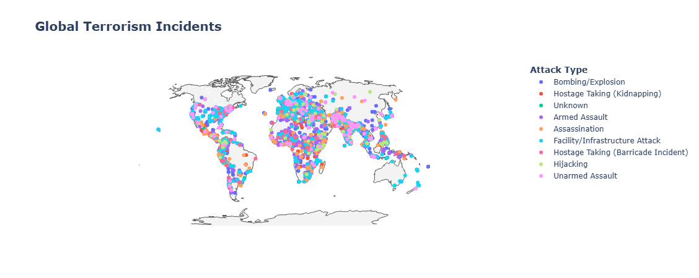

# 🌍 Global Terrorism ML Project

[](https://www.python.org/) 
[](https://jupyter.org/) 
[](#license)
[]()

> **Analyze global terrorism trends** and **predict terrorist group responsibility** using **EDA & Machine Learning** on the [Global Terrorism Database](https://www.start.umd.edu/data-tools/gtd).  

---

## 📑 Table of Contents
- [Overview](#-project-overview)
- [Key Insights](#-key-insights)
- [Tech Stack](#-tech-stack)
- [EDA Highlights](#-exploratory-data-analysis)
- [Data Cleaning](#-data-cleaning-pipeline)
- [Project Structure](#-project-structure)
- [Future Enhancements](#-future-enhancements)
- [Author](#-author)
- [License](#-license)

---

## 📌 Project Overview

- **Dataset:** [Global Terrorism Database](https://www.start.umd.edu/gtd-download)  
- **Incidents:** 289,796 (1970–2020)  
- **Original Features:** 135 → **Reduced to 11** (model-ready)  
- **Goal:**  
  - Uncover **temporal, geographical, and tactical** terrorism patterns.  
  - Build a foundation for **predictive modeling** to attribute attacks to terrorist groups.  

---

## 📊 Key Insights

- **2014:** Peak in global terrorism (ISIL surge).  
- **Hotspots:** Iraq, Afghanistan, Pakistan dominate incidents.  
- **Top Groups:** **Taliban & ISIL** lead post-2010.  
- **Tactics:** **Bombings** are the most frequent; **suicide attacks <5%** but highly impactful.  



---

## 🛠 Tech Stack

| Category          | Tools/Libs                  |
|-------------------|-----------------------------|
| **Language**      | Python 3.9+                 |
| **Data Processing** | pandas, numpy              |
| **Visualization** | matplotlib, seaborn, plotly |
| **Environment**   | Jupyter Notebook            |

---

## 🔍 Exploratory Data Analysis

<details>
<summary>Click to expand</summary>

- **Incidents by Year:** Steady rise post-2000, **peak in 2014**.  
- **Top Countries:** Iraq, Pakistan, Afghanistan dominate.  
- **Regional Heatmaps:** Show variation in attack types by region.  
- **Suicide vs Non-Suicide:** <5% are suicide attacks.  
- **Interactive Map:** Global distribution of incidents.  

</details>

---

## 🧹 Data Cleaning Pipeline

- **Dropped:** High-missing & irrelevant columns (>20%).  
- **Selected:** 10 essential features + target (`GroupName`).  
- **Imputation:** Mean (numeric), Mode (categorical).  
- **Standardized:** Column names & unknown values.  
- **Output:** `globalterrorismdb_cleaned.csv`.

---

## 📂 Project Structure

```
├── Cleaned Dataset/                # Cleaned GTD dataset
├── Original Dataset/               # Raw GTD dataset
├── Data_Cleaning_2.ipynb           # Data preprocessing
├── Main_EDA_3.ipynb                # EDA & insights
├── Global_Terrorism_Incident_Map.png  # Map visualization
├── global_terrorism_map.html       # Interactive map
├── ML Report.docx                  # Detailed project report
└── README.md                       # Project documentation
```

---

## 🚀 Future Enhancements

- **Model Development:** Implement & tune **Random Forest, XGBoost, Neural Networks** for predicting terrorist groups.  
- **Feature Engineering:** Derive more insights (e.g., cluster coordinates, temporal group patterns).  
- **Deployment:** Interactive **Streamlit/Dash** dashboard for real-time insights.  
- **Explainability:** **SHAP values** for interpreting ML model predictions.

---

## 👤 Author

**Ayush Gupte**  
PRN: 22070521120 | Batch: 2022–26 | Section: C  
GitHub: [AyushGupte-22](https://github.com/AyushGupte-22)

---

## 📜 License
This project is for **academic & research purposes only**.  
Data is sourced from [GTD](https://www.start.umd.edu/data-tools/gtd).

---
